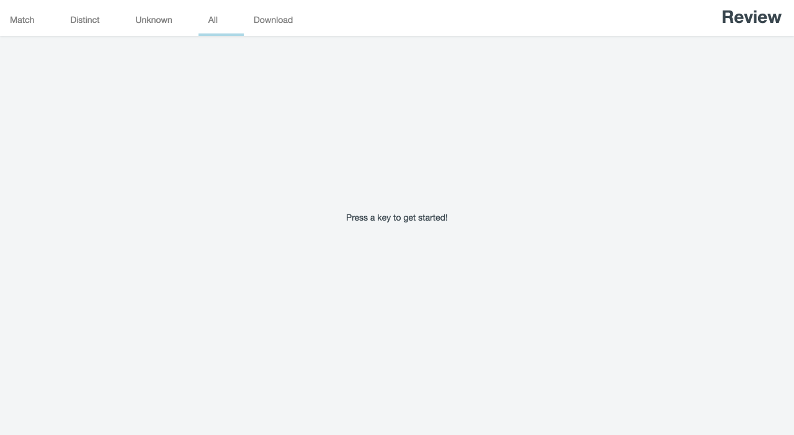

Record Linkage Review
=====================

**Record Linkage Review** is a browser-tool to compare two or more records on specified fields. Such a tool is often needed in deduplication or linking datasets. A few of the possible uses:

- Link records in small datasets.
- Verify an existing record linkage.
- Make a golden dataset for training classifiers.

Record Linkage Review has a user friendly interface. The interface is extraction free/low to prevent human errors. 



Getting started
---------------

The **Record Linkage Review** tool runs in the browser and needs a local file server (to prevent issues with cross-site scripting). Start with running a local static file server.  A few examples are listed below: 

Python 2

```shell
$ python -m SimpleHTTPServer 8000
```

Python 3

```shell
$ python -m http.server 8000
```

Node.js

```shell
$ npm install -g node-static   # install node-static
$ static -p 8000
```

Is your favorate programming language not listed above? See https://gist.github.com/willurd/5720255 for more static file servers. 

Then navigate in your browser to http://localhost:8000/review.html. Now you can start comparing records. 

Reviewing
---------

The reviewer reviews the records pairs with it's keyboard or by clicking the classification button.

Features:

- Use keyboard for classification; Right arrow is match, Left arrow is distinct. Use arrow up and down for next record pair. 
- Use buttons for classification
- Use navigation menu for changing categories. 

Configuration
-------------

Before the reviewer can start, a configuration file needs to be made. This file specifies the record files to compare. Here you can also specify which fields to compare with each other. The settings are stored in a JSON file and it has the following structure:

``` json
{
    "version":1,
    "analysis":"simple",
    "records":{
        "census1990":{
            "filepath":"census1990.csv",
            "type":"csv",
            "delimiter":",",
            "description":"Census data of 1990.",
            "index_column":"id"
        },
        "census2000":{
            "filepath":"census2000.csv",
            "type":"csv",
            "delimiter":",",
            "description":"Census data of 2000."
        }
    },
    "compare":[
        {
            "values":[
                {
                    "records":"census1990",
                    "label":"name"                
                },
                {
                    "records":"census2000",
                    "label":"firstname"
                }
            ],
            "type":"string"
        },
 
        ...

        {
            "values":[
                {
                    "records":"census1990",
                    "label":"date_of_birth"
                },
                {
                    "records":"census2000",
                    "label":"date_of_birth"
                },
            ],
            "type":"string"
        }
    ]
}
```

License
-------

The license for this record linkage tool is GPLv3.
